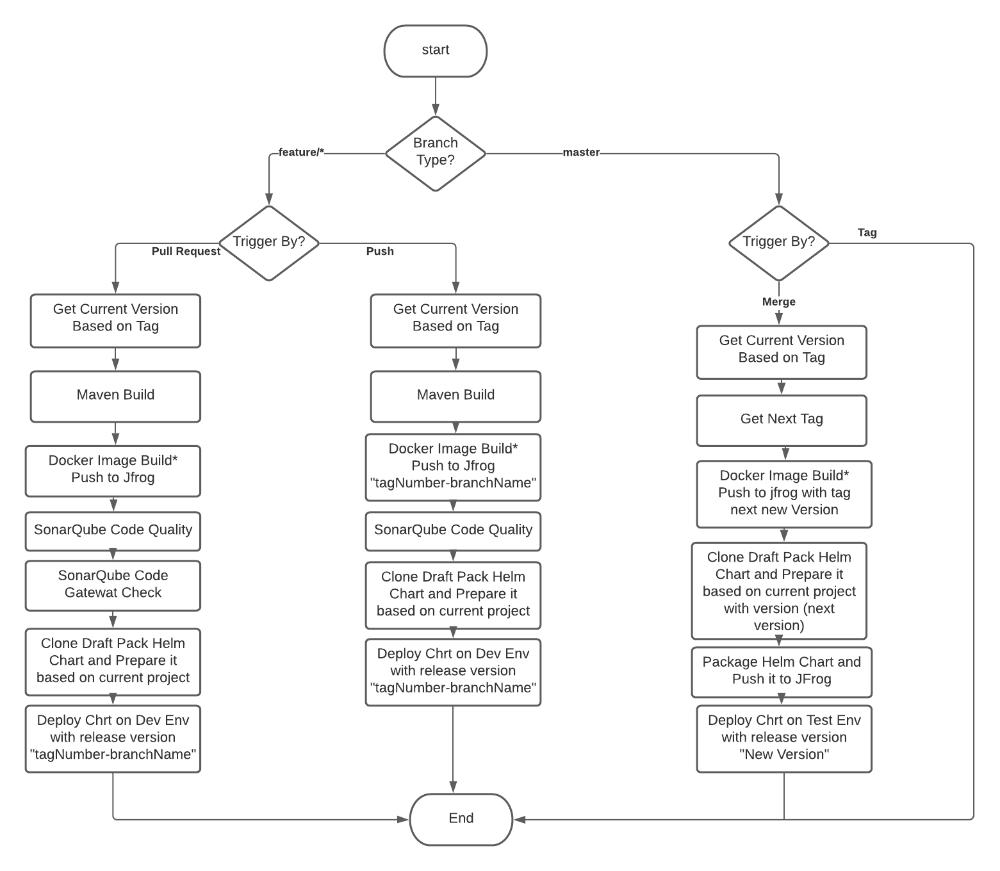

# Demo Service Pipeline
This project is created by this service intial pipeline that will create the intial version of the service with name and draft-pack-version
https://github.com/mohamedhani/init-service
**Prerequists**
1) Add github credentials to AzureDevops Library with this name "github"
  variables are: 
   *  github_clint_id
   * github_clint_secret
2) Add Jrog credentials to AzureDevops Library with this name "jfrog"
   variables are:
   * jfrog_password
   * jfrog_server
   * jfrog_username

3) set you project name on variable "ProjectName"
4) setup service-connection with:
    * SonarQuve
    * Dev Environment  (Dev Namespace)
    * Test Environment (Test Namespace)
    * Prod Environment (Prod Namespace)
    * GitHub
5) setup agent that have all of these tools:
    * helm
    * kubectl
    * yq
    * mvn
    that agent could be a docker container or vm.

## How Pipeline Work
**There are two Flow based on Below Digram**

**Notes:**
  * You can't merge feature branch to main branch if the pipeline is not green
  * You shouldn't push any tag on (main or feature/*) branches.
  * You shouldn't push any commit on main branch directly 
  * Each release with have same tag on main branch, docker image on jfrog, and helm chart on jfrog 
  * once testing team test the service and the service is working fine. operation team can  deploy the chart with the release name on production environment with separate pipline
  * you can find draft-pack repo here https://github.com/mohamedhani/draft-pack 
